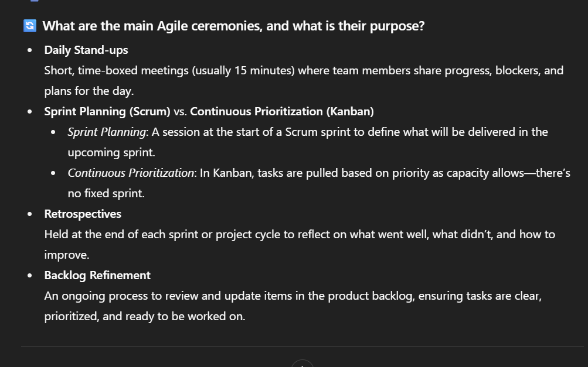

## When should you use AI for assistance, and when should you rely on your own skills?
AI is great for brainstorming, drafting, or speeding up repetitive tasks. But for critical thinking, decision-making, or anything requiring personal judgment and creativity, I should rely on my own skills.
One task that I can use AI for is record and transribe meetings, summarise meeting notes, drafting emails, making sure the emails I'm writing are in professional voice.
Here is a screenshot on debugging a GitHub error with ChatGPT. Although I asked it what the error means, I read it carefully and make sure the commands I used won't break anything: 
Another screenshot where I ask AI to summarise the Agile Principles and give me ideas to answer the onboarding questions: 
However, I fact-check it with this link from Atlassian to make sure the AI does not make up false information before I added it to my file: https://www.atlassian.com/agile/scrum/ceremonies#:~:text=Scrum%20ceremonies%20provide%20a%20structured,sprint%20review%2C%20and%20sprint%20retrospective.

## How can you avoid over-reliance on AI while still benefiting from it?
 By treating AI as a helper, not a replacement. I’ll always review, edit, and add my own perspective instead of just copying what it gives me.
 One best practice I’ll follow when using AI tools at Focus Bear is to always double-check the accuracy of the content before I use it, instead of just copy-pasting. 
## What steps will you take to ensure data privacy when using AI tools?
I won’t put in sensitive or personal info. I’ll also double-check privacy settings and only share work-related details that are safe to disclose. 