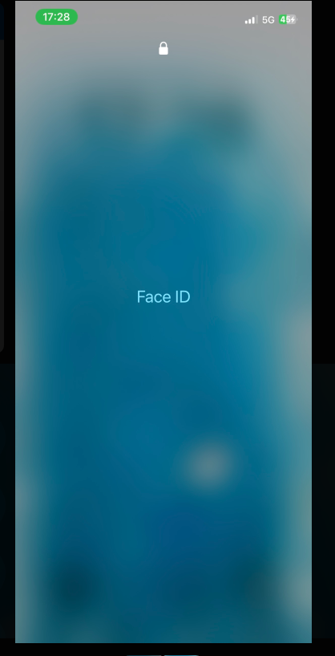

#  Reflection
## What security measures do you currently follow, and where can you improve?
I already use strong passwords for most accounts, and I’ve got 2FA turned on for a few key ones (student account, GitHub and Facebook accounts). But I know I could improve by making sure every account has unique, strong passwords (no more reusing old ones just because they’re easy to remember). 

## How can you make secure behaviour a habit rather than an afterthought?
I think it’s about making it automatic, like always adding new logins to a password manager right away and never skipping 2FA, even if I’m in a rush. 
## What steps will you take to ensure your passwords and accounts are secure?
I’ll properly set up a password manager, make sure all my passwords are long and unique, and turn on 2FA wherever it’s offered.
Password Manager has saved me a lot of times as I don't remember all of my passwords. One time, I had to log on Figma for work which I barely use, luckily I enabled password manager to save my password for the site.
## What would you do if you suspected a security breach or suspicious activity on your account?
If I ever suspected a breach, my first move would be to change the password right away, check activity logs, and lock things down before contacting support.
# 🛠️ Task
## Ensure your work accounts have strong passwords and enable 2FA where possible.
I went through my accounts and enabled 2FA where possible.

## Review your password storage method—if you’re not using a password manager, consider setting one up.
I'm using Google Password manager for my desktop and the system password manager on Iphone

## Set up your computer and phone to automatically lock (require a password or biometric login) if you are away for more than a few minutes
On phone I also use Face ID and 6-digits passcode

## Document one new cyber security habit you will follow at Focus Bear.
Always add new accounts to the password manager right away and enable 2FA by default.
