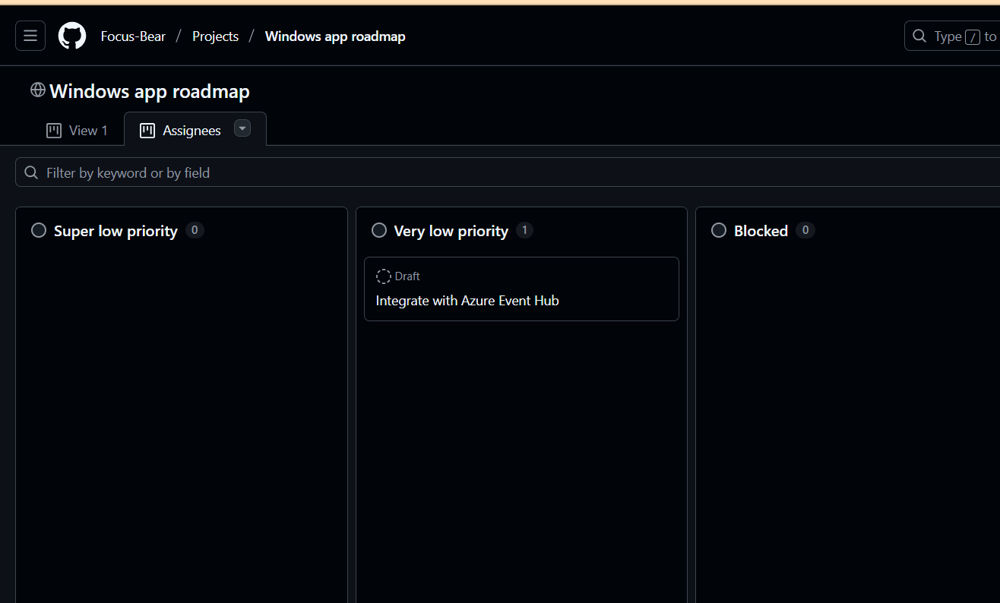

# Research & Learn

## How does a Kanban board work, and how does it help manage workflow?
- Kanban board uses tasks as cards and places them in columns representing different stages of progress (e.g, To do, In-progress, Done, etc) to help teams manage and track work in a simple, clear way. When a task is done, it will be moved  to the Done column, helping the team see what’s being worked on, what’s stuck, and what’s already done. 
- Kanban board help manage workflow by improving transparency, enabling teams to focus on priorities, and makes it easy to spot bottlenecks or overloaded team members.
## What do the different columns on a Kanban board represent? (e.g., Backlog, In Progress, Blocked, Done)
- Each column represents a specific activity that together compose a “workflow”. Cards flow through the workflow until completion. In simpler words, different columns means different stages of progress. As work progresses, cards move across columns, allowing teams to monitor and improve their efficiency.
## How do tasks move through the board, and who is responsible for updating them?
- As work progresses, tasks are moved from left to right through the board, demonstrating the stages they're at.
- Each team member is responsible for updating their own tasks. This keeps the board up to date and helps everyone see what’s happening across the project in real time.
## What are the benefits of limiting work in progress (WIP)?
- Reduce multitasking, so team members can focus and finish tasks faster
- Avoid bottlenecks, especially if too many tasks pile up in one column
- Improve flow, making it easier to track progress
- Highlight blocked work, so issues can be solved early

# Reflections

## How does Kanban help manage priorities and avoid overload?
- Kanban helps manage priorities by displaying all tasks on a board, making it easier to spot the one with higher priority to do first. As tasks will be placed in columns depending on their status, I can easily check which tasks are active and which tasks that need to take action next.
- To avoid overload, Kanban limits how many tasks can be in-progress at once using WIP. It helps make sure that I don’t take on too much at the same time, which improves focus and reduces stress. It also makes it easier to finish one task before starting another, which keeps the workflow smooth.

## How can you improve your workflow using Kanban principles?

I can improve my workflow by breaking large tasks into smaller, more manageable steps and moving them across the board as I complete each one. This gives me a clear sense of progress and keeps me motivated. I’ll also try to avoid multitasking, so I stay focused on finishing one thing at a time. Regularly reviewing the board will also help me spot blockers early to seek help from my supervisors and adjust priorities when needed.

# Task
Check out Focus Bear’s Kanban board and note how tasks are structured. (Hint: Look in GitHub Projects.)

# Move at least one task through the Kanban process and update its status correctly.
Move the Integrate with Azure Event Hub from super low priority to Very Low Priority

# Identify one way you can improve task tracking in your role.
I could improve task tracking by breaking my design work into smaller, clearer steps on the Kanban board so it’s easier to see what’s done, what’s in progress, and what’s stuck. That way, I and the team can quickly spot issues and keep things moving smoothly.
