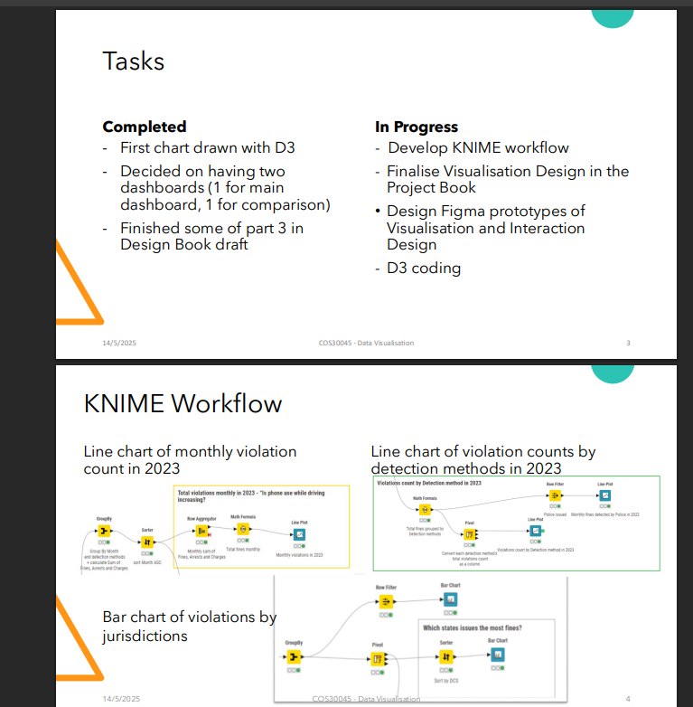
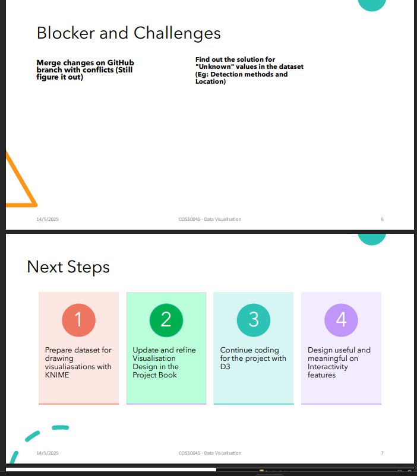
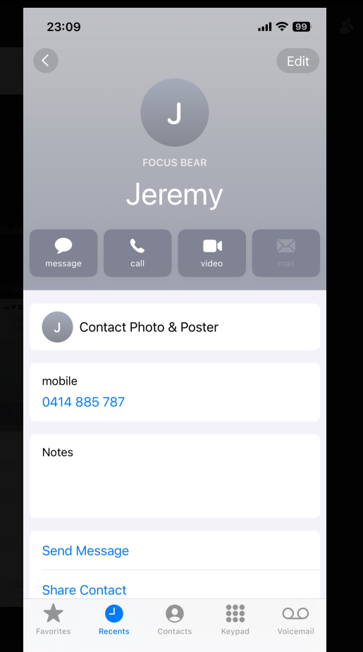

# 📝 Reflection: Working with Supervisors at Focus Bear

## Have you ever experienced or witnessed great teamwork and professionalism? What made it effective?
Yes, in a previous group project at uni, our team had a shared Google Doc where we tracked progress, blockers, and next steps. Everyone came prepared to meetings with updates, which made discussions efficient and respectful. What made it effective was clear communication, accountability, and a sense of fun that kept motivation high.
This is an example of where we keep tab of our progress including completed tasks, incompleted tasks, blockers, and next steps to present to our supervior.

## What steps can you take to make sure your communication is clear, respectful, and inclusive?
- Use simple, direct language.  
- Acknowledge others’ input and ask clarifying questions rather than making assumptions.  
- Be mindful of tone in text (adding context or emojis when appropriate to avoid sounding blunt).  
- Double-check instructions or feedback by repeating them back to confirm understanding.  

## How can you help create a positive, fun, and professional work environment?
- Share small wins or encouragement to keep morale high.  
- Respect people’s time by coming prepared.  
- Stay open to feedback and treat mistakes as learning opportunities.  
- Balance professionalism with lightheartedness (e.g., friendly greetings, celebrating progress).  

## How can you prepare effectively for meetings with supervisors and colleagues?
- Read the project brief and check my progress beforehand.  
- Bring a short agenda or at least a list of questions/blockers.  
- Take detailed notes so I don’t repeat questions.  
- Test tech (meeting links, mic, camera) before the call so time isn’t wasted.  

## What would it look like to be proactive during your internship?
- Providing weekly updates without being asked.  
- Exploring solutions before escalating issues (Google/ChatGPT → teammate → supervisor).  
- Suggesting next steps instead of waiting for instructions.  
- Anticipating possible blockers and flagging them early.  

## How might you follow up with colleagues or supervisors if you need information/action from them?  
- Start with the lightest channel (email or message).  
- If no reply in 24–48 hours, follow up on Discord/Teams.  
- If still blocked and it’s urgent, escalate to SMS.  
- If it really urgent, I'd call the CEO as I saved his number in my contact 

## What are some things you won’t do?
- Sit idle waiting for instructions.  
- Come to meetings unprepared.  
- Ask basic questions I could have Googled.  
- Ignore feedback or miss action items.  
- Ghost the project without updates.  
- Multitask during meetings and not listen actively to what's covered.
