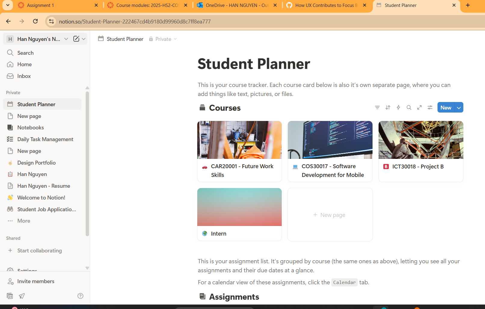

# 🔍 Research & Learn
## How does good UX design improve productivity for neurodivergent users?
Good UX helps users focus on tasks without unnecessary distractions. By keeping the interface clear, consistent, and predictable, neurodivergent users can complete tasks faster, make fewer mistakes, and feel less stressed while using the app.
## What are common UX pain points for people with ADHD & Autism?
-Cluttered screens with too many options or visuals increase cognitive overload: Users with ADHD and autism can easily become overwhelmed by too much information or stimuli, making it difficult to focus on the task at hand. 
- Complex languages: abstract ideas can be challenging to grasp, requiring more literal explanations. 
- Excessive animations, flashing elements, loud sounds, and busy layouts can be distracting and overwhelming, especially for individuals with sensory processing sensitivities. 
- Unclear instructions, vague labels: lack of clear, concise, and helpful error messages can be frustrating and lead to users giving up. 
- Time-based tasks, countdowns, and urgent messages can be stressful and anxiety-provoking. 
## What makes an interface overwhelming vs. intuitive for neurodivergent users?
- Overwhelming: Too many elements, inconsistent layouts, bright flashing colors, long unstructured forms, or confusing instructions.
- Intuitive: Simple, clean layout, clear instructions, consistent placement of buttons, minimal distractions, and clear feedback for actions.
## How can clear navigation, minimal distractions, and predictable UI patterns improve user experience?
- Clear navigation helps users know where they are and where to go next.
- Minimal distractions allow users to focus on the task without being pulled away.
- Predictable UI patterns let users form habits and mental models, reducing cognitive load and helping them complete tasks efficiently.
# 📝 Reflection
## If a new feature looks visually appealing but is hard to use, how should UX designers handle that tradeoff?
When a feature looks nice but is confusing or difficult to use, I always put usability first. For me, it’s important to find ways to keep the feature visually appealing while making it clear and easy to use. This might mean simplifying the layout, adding helpful feedback, or keeping design elements consistent so users can quickly understand how to interact with it. 
I’ve experienced this first-hand using Notion. Its templates look amazing at first glance, but sometimes the amount of options and hidden menus make it confusing to actually get work done. I had to spend extra time watching tutorials before I could use it properly. That’s a clear example of design leaning too much on aesthetics without considering usability. This picture shows that the side bar of Notion contains a lot of options and templates, which took me sometimes to wrap my head around.

## What specific challenges might neurodivergent users face when using productivity apps?
- From my experience, neurodivergent users often struggle with:
- Cluttered or inconsistent layouts, which make it hard to focus.
- Too many options or settings, which can be overwhelming.
- Pop-ups, notifications, or flashy animations that break concentration.
- Long, complex workflows without clear guidance or progress indicators.
When design for Focus Bear, I'll try to reduce these pain points by keeping the interface simple, predictable, and focused on one task at a time.
## How can Focus Bear's UX differentiate itself from other productivity tools?
I believe Focus Bear can stand out by combining simplicity, cognitive load reduction, and accessibility. Features like adjustable fonts, dark mode, and two display modes (Simple and Geek) allow users to tailor the experience to their needs. Consistent navigation, minimal distractions, and breaking tasks into manageable chunks make it easier for users to focus and stay productive, which is something many other apps overlook. For me, the goal is to make productivity feel natural and stress-free, especially for neurodivergent users.

Compared to tools I’ve used like Notion, which often overload you with choices, Focus Bear can feel lighter and more user-friendly. For me, the goal is to make productivity feel natural and supportive, especially for neurodivergent users who often need structure without sensory overload.