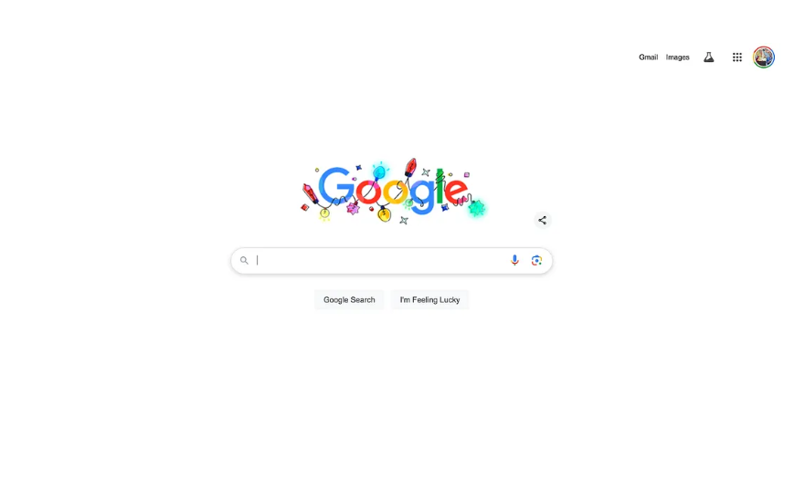
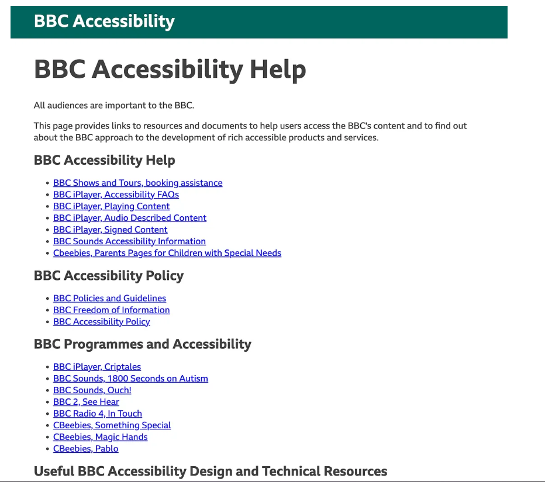

# 🔍 Research & Learn
## What common UX barriers affect neurodivergent users?
- Ambiguous language & unclear instructions: Jargon, vague wording, or unclear calls-to-action.
- Time pressure: Countdown timers, auto-advancing screens, or short form timeouts.
- Cluttered layouts increase cognitive load and decision fatigue
- Inconsistent UI patterns disrupt task flow
- Overuse of animations and motion fragments focus
- Long, unstructured forms discourage task completion
- Lack of reminders or progress indicators leads to abandonment
## How can predictability, clear feedback, and reduced distractions improve usability?
- Predictabilty: When layouts, labels, and interactions stay consistent, users can form mental shortcuts. They don’t waste energy re-learning how things work.
- Clear feedback: Ensures users know what’s happening and what to do next. This prevents anxiety from uncertainty
- Reduced distraction: Helps maintain focus, especially for ADHD or sensory sensitivities. Cutting down on visual and audio noise helps people stay with the task instead of bouncing between competing elements.
## Why do overly complex interfaces cause issues for people with ADHD?
- Difficult to navigate
- Cognitive overload
- Visual clutter can trigger task-switching impulses, pulling users away from the main goal.
- Unnecessary complexity makes it harder to enter hyperfocus, where productivity spikes.
## What are some real-world design examples that improve accessibility for neurodivergent users?
Google Search: extremely clean interface with high-priority content and minimal distractions.

BBC’s accessibility features: allow users to adjust text size and contrast, making it easier to consume content.

# 📝 Reflection
## How can Focus Bear’s design choices make tasks easier for neurodivergent users?
- Allow users to customize text size and contrast to suit their needs.Offer personalization options, such as adjustable font size, tone, or toggle for dark mode. This allow users to choose the most comfortable settings to their likings. 
- Allow users to switch between Simple Mode (minimalist) and Geek Mode (more detail) depending on their preference.
- Focus Bear also break content into manageable chunks of short paragraphs, bullet points, or collapsible sections to reduce cognitive overload, make it easier for neurodivergent users to focus on 1 piece of information at a time. For example, the routine tasks are designed with clear segmentation with concise text content and appropriate sizing. 
## If a feature is technically useful but cognitively overwhelming, how should it be redesigned?
Yes, our focus is on neurodivergent users, if they feel a feature is cognitively overwhelming, as a result, they will likely to give up the app as it makes them overwhelmed. Therefore, it is essential to redesign that. It can be redesigned like:
- Splitting it into smaller, guided steps.
- Hiding non-essential options until they’re needed.
- Simplifying the layout so the key action is obvious.
## What are some small UX adjustments that can significantly improve user experience for neurodivergent users?
- Keep navigation consistent across all screens.
- Use plain, descriptive language.
- Let users choose how often they get notifications.
- Highlight the current step or progress in multi-step tasks.
- Provide a distraction-free mode that hides non-essential elements.