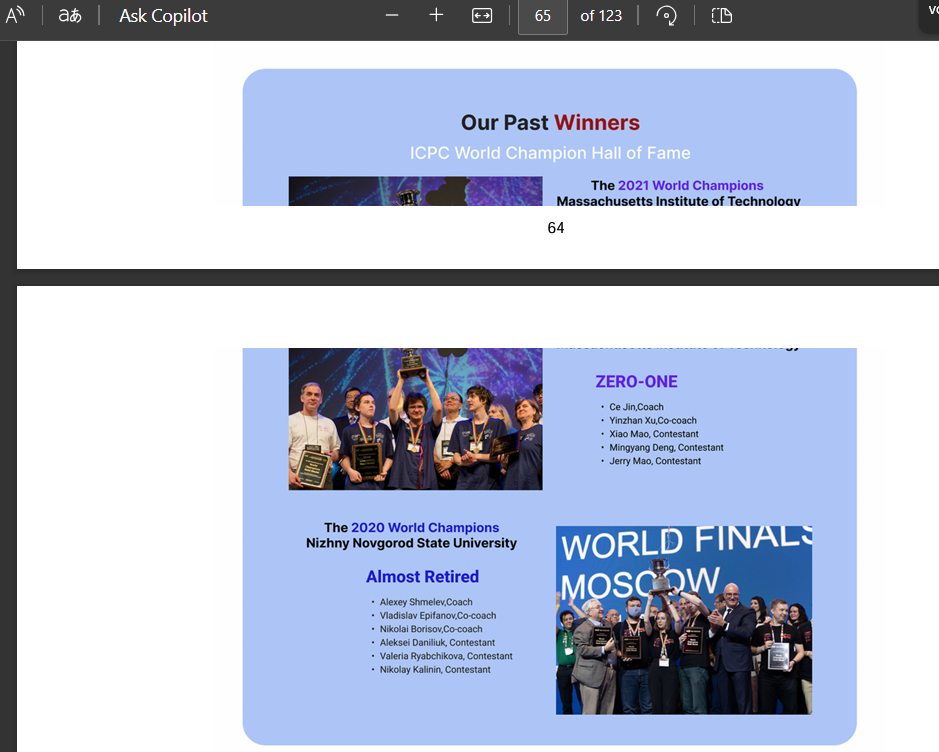
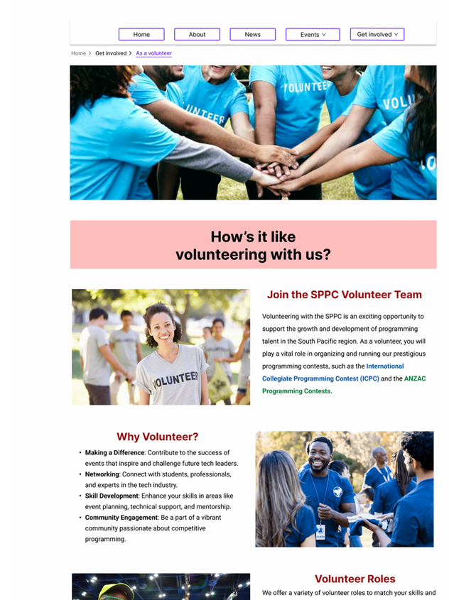

# 🔍 Research & Learn
## What are common methods for analyzing usability test results?
- Identify patterns: Look for recurring issues across multiple users or tasks, suggesting a systemic problem. 
- User feedback: analyse verbal feedback from users, including their comments, suggestions, and frustrations. 
- Task completion rates: Calculate the percentage of users who successfully completed a task
- Time on task: see if a task takes longer than expected.
- Organise and prioritise issues: rank issues from minor inconvenience to major blocker, so we know which issues need to be address first.
## How can UX designers avoid bias when interpreting feedback?
- Focus on what users actually did, not what we assume they meant.
- Have more than one person review the notes to catch different perspectives.
- Use recordings or written notes instead of just relying on memory.
- Keep user quotes separate from your own thoughts.
- Don’t ignore feedback just because it doesn’t match the personal design taste.
## What’s the difference between actionable insights vs. subjective opinions?
Actionable insights are findings backed up with data, whcih lead to concrete actions, while subjective opinions are based on personal feelings and preferences, which may not be reliable for decision-making. 
## How do you prioritize user feedback when multiple users have conflicting requests?
When users give conflicting feedback, the first step is to organise it and look for patterns. Sometimes the conflict comes from different needs, so it’s important to dig into the root cause. After that, I’d weigh how much each piece of feedback matters, like does it impact many users, core functionality, or key business goals. Finally, I’d bring in the team to discuss and agree on priorities, then test changes and adjust based on results.

# 📝 Reflection
## If one user complains about a feature but others like it, how should UX handle it?
One person’s complaint doesn’t always mean the feature is broken. I’d first check if it’s an isolated case or if others might feel the same way but haven’t said it. If most users are fine with the feature, it may not need a big change, but it’s still worth noting in case more patterns show up later. In my project of redesigning South Pacific Programming Association website, I tied each persona with a different theme color (contestant page is blue, while volunteer page is orange), a user complained that this doesn't look consistent, however, a majority of the users said they prefer it this way as it highlight the distinction of each use group, while still keep the website visually balance.

## How can patterns in feedback help identify real UX issues?
When the same problem keeps coming up across different users, that’s usually a real UX issue. Patterns show that it’s not just personal preference but something that’s affecting multiple people in the same way.
## What are the risks of making changes based on limited or unverified feedback?
Relying on feedback from just a few people can be detrimental to both the product and user satisfaction. It’s important to double-check feedback, understand the situation behind it, and think about the risks before making any changes. A better approach is to gather input from different types of users, use several research methods, and confirm the findings with testing.