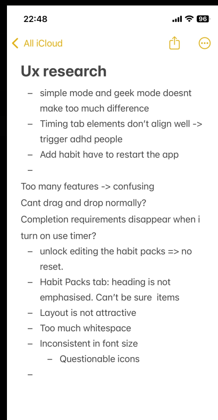

# Documentation of my friend's experience

I have conducted the usability testing of the Edit Habits on Desktop view with my friend, who is diagnosed with ADHD.
Here are their feedback after the test:

## Their feedbacks
1. **Navigate to edit habits**  
   Imagine you want to adjust your daily routine. Try to find where you can edit the habits in the app.  

2. **Understand the tabs**  
Q:   Look at the tabs in the Edit Habits section.  
   - What do you think each tab means?  
   - What would you expect to see under them?  
A: It looks like a distraction app blocker that is pre-configured for an entire day
3. **Timing tab**  
Q:   The app asks you a few questions when setting up routines in the Timing Tab.  
   - Do these questions feel relevant to you?  
   - If not, what kinds of questions would feel more useful?  
A: 	The alignment is mismatched and it's making it distracting me from focusing on what each line of question is asking
4. **Add & edit a habit**  
Q:   Try adding a new habit, renaming it, and then changing the order of habits.  
   - How easy or difficult was this?  
   - How did you feel about that?  
A: 
- The task was pretty easy and straightforward.
- A save option on each task (instead of just one save button at the bottom) would make it feel more assured my edits are being changed, and also easier to undo certain accidental changes
5. **Explore the design**  
Q: Spend a minute exploring the Edit Habits section.  
   a. What do you think of the layout, font sizes, and colors used?  
   b. Is anything distracting or hard to read?  
A: 	
a. The colours the interface looks pleasing. Only issue is the alignment on the edit habit tab. The font size should be adjusted base on the level they are (follow the hierarchy) for example, in the Morning Routine section, why does the "User Timer"'s font size is bigger than the habit itself although they are put in the same container.

b. 	Yes, the edit habits tab misalignment is making the app more distracting, and made me forgot to understand what I am reading. 
## Follow-up Questions
- Overall, how did you feel about editing routines?  
A: The editing and adding is pretty straightforward, although slightly lost with finding the save button because it is in the bottom and could not be seen unless scrolled
- What part was easiest for you?  
A: Finding the tabs I want once I realised they are located in the big window is quite straightforward
- What part was confusing or frustrating?  
A: I tried to find the "edit habit" tab from the mini-window for few minutes before realising the button is only found on the big window, which caughts me off-guard slightly
- Did the app behave as you expected? Why or why not?   
A: The need to restart the app after editing each task was not expected, as it makes editing more frustrating
- If you could make changes about this feature, what would it be?  
A: Fix the alignment Try to make the app not require a restart Add the ability to exclude schedule from applying specific days of the week

This is a screenshot of my note while interviewing my friend: 
# My analysis: Usability Testing Report of Focus Bear's Edit Habits (Desktop)

## 1. Overview
This report summarizes usability testing of the **Edit Habits** feature in the Focus Bear desktop app.  
I conducted a test with one participant (diagnosed ADHD) to gather direct feedback, as well as a small pilot group of six users for comparison.  

**Overall findings:**  
- Editing and adding habits was mostly straightforward.  
- Alignment, font hierarchy, and the location of the save button caused confusion.  
- The requirement to restart the app after edits was very frustrating.  
- Participants suggested clearer save options, improved visual consistency, and habit customization features.

---

## 2. Participant Profile
- **Number of participants (main session):** 1 (diagnosed ADHD, unfamiliar with Focus Bear)  
- **Comparison pilot group:** 5 additional participants (18–50, ICT/CS backgrounds, mix of first-time and returning users)  
- **Context:** Desktop app, in-person session  

---

## 3. Methodology
Tasks given to the participant included:
1. Navigate to the Edit Habits section.  
2. Explore and interpret the tabs.  
3. Use the Timing tab and evaluate its relevance.  
4. Add, rename, and reorder habits.  
5. Explore the design for layout, readability, and visual clarity.  
6. Answer follow-up questions on ease of use, frustrations, and expectations.  

Feedback was collected through **direct observation, interview questions, and post-task reflection**.  

---

## 4. Participant Feedback (ADHD user)

### Task 1: Navigate to Edit Habits
- **Observation:** Participant initially looked for “Edit Habits” in the mini-window before realizing it was only available in the larger window.  
- **Quote:** “I tried to find the ‘edit habit’ tab from the mini-window for a few minutes before realising the button is only in the big window.”  

### Task 2: Understand the Tabs
- **Response:** Tabs looked like a “preconfigured distraction blocker for the day.”  
- **Issue:** Expectation mismatch — user assumed more granular control.  

### Task 3: Timing Tab
- **Response:** Questions were relevant but **misaligned UI distracted focus**.  
- **Quote:** “The alignment is mismatched and it distracted me from what each line was asking.”  

### Task 4: Add, Rename & Reorder Habits
- **Response:** Easy to complete, straightforward overall.  
- **Suggestions:**  
  - Add a per-task save option.  
  - Undo accidental changes.  
  - Current single save button at bottom was hard to notice.  

### Task 5: Explore Design
- **Positive:** Colors were pleasing, overall layout simple.  
- **Negative:** Misaligned elements and inconsistent font hierarchy broke focus.  
- **Quote:** “Why is the timer text bigger than the habit itself? That doesn’t make sense.”  

### Follow-Up
- **Easiest:** Finding tabs once noticed in the main window.  
- **Most confusing:** Locating edit options and missing save button.  
- **Unexpected:** App restart required after edits.  
- **Suggestions:**  
  - Fix misalignment and font hierarchy.  
  - Remove restart requirement.  
  - Allow exclusion of routines from specific days.  

---

## 5. Key Findings Across Participants
- **Positive:** Editing/adding habits felt intuitive once discovered.  
- **Pain Points:**  
  - Restart required after edits (major).  
  - Misaligned elements distracted attention (major).  
  - Save button placement not obvious (medium).  
  - Drag-and-drop reordering not intuitive (medium).  
  - No preset suggestions for habits (low).  

---

## 6. Recommendations
1. **Remove restart requirement** – edits should save and apply instantly.  
2. **Fix misalignment & font hierarchy** – establish clear visual rules.  
3. **Improve save behavior** – allow per-task saves, undo/reset option.  
4. **Enhance discoverability** – make Edit Habits clearly accessible in all windows.  
5. **Support personalization** – allow excluding schedules on certain days, add preset habit suggestions.  

---

## 7. Conclusion
The **Edit Habits** feature has strong potential but key usability flaws reduce effectiveness, especially for neurodivergent users. Small but critical fixes—like alignment, save options, and removing the restart requirement—would significantly improve both accessibility and overall user satisfaction.

 
# 📝 Reflection
## What surprised you the most about how your test participant used the app?
What surprised me most was that they struggled to locate the “Edit Habit” tab at first. I assumed it would be obvious, but they spent time looking for it in the mini-window before realising it was only available in the larger window. This showed me that something I thought was straightforward might not actually be clear to a new user.
## Did they encounter any issues that you didn’t expect?
 One unexpected issue was that the app required restarting every time a habit was edited. I didn’t anticipate this at all, and my participant mentioned it made the experience frustrating and time-consuming. I also didn’t expect how much the misalignment of elements would trigger them, especially since they already find it difficult to focus due to ADHD.
## How could this test improve your approach to UX design?
This test improves my approach to UX design by reminding me to pay more attention to details like alignment and font hierarchy, because they can have a big impact on usability, especially for people with attention challenges.
In future designs, I’ll make sure to check visual consistency and apply proper hierarchy to reduce distraction. I also learned the importance of giving users reassurance when making edits, such as having save options for individual tasks instead of one button at the bottom. 

 

 