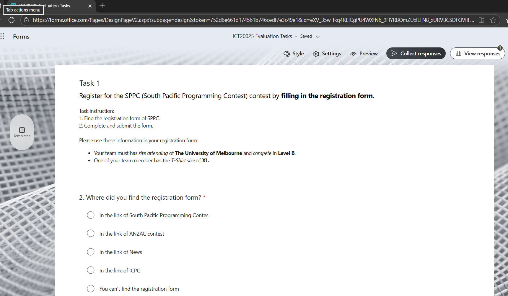
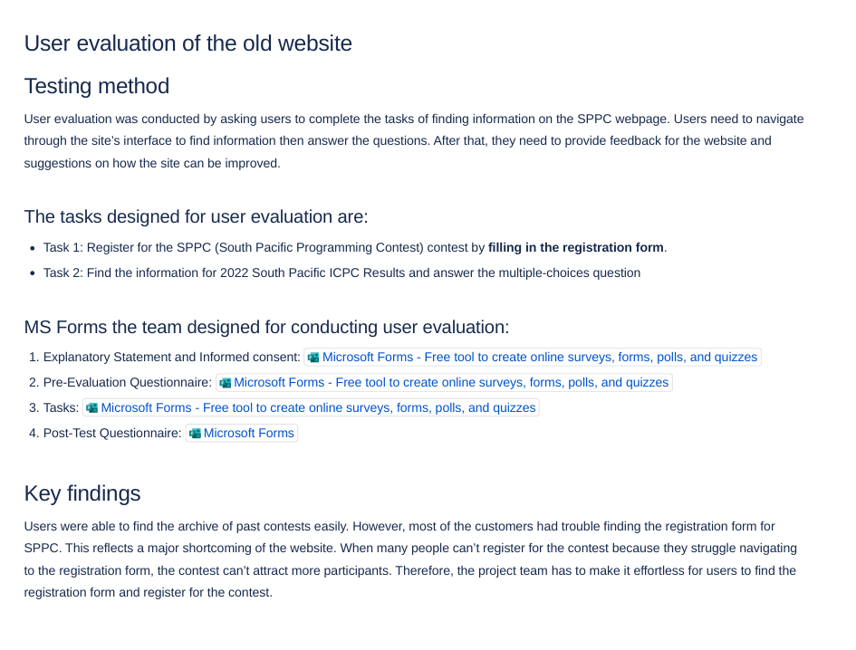

# 🎤 How to Conduct User Interviews & Usability Testing
# 🎯 Goal
Learn best practices for conducting user interviews and usability tests to gather high-quality insights.

# ❓ Why is this important?
User interviews and usability tests help designers understand real user needs. However, if conducted poorly, they can lead to misleading results due to bias, leading questions, or artificial testing conditions.

# 🔍 Research & Learn
## What are best practices for conducting user interviews?
- Identify the interview goal (research purpose)
- Prepare interview guide: 
+ Contains a few well-designed, open-ended questions that get participants talking and sharing their experiences.
+ Followup questions to gather more-detailed information. Should construct followup questions based on your research goals. 
- Select a participant that in your target audience, avoid group sessions 
- Have a notetaker and recording (Could be AI)
- Keep sessions short (20–45 minutes) to avoid fatigue.
- Avoid: leading questions, many questions in one, assumptive questions, closed Yes/No questions.

## How do you run an effective usability test without influencing the user?
- Give the user a clear task (e.g., “Set up a focus session”) without showing them how to do it.
- Stay neutral, avoid reacting with surprise, approval, or disapproval.
- Ask users to “think out loud” so you can hear their reasoning.
- Save clarifying questions for after the task is complete.
- Test in a realistic environment whenever possible (same device, same context).
## What types of questions should UX designers ask during interviews?
- Experience-based: “Can you walk me through how you usually start your day with Focus Bear?”
- Problem-focused: “What’s the hardest part about staying focused when using productivity apps?”
- Preference-based: “How do you feel about having more customization options versus a simpler interface?”
- Reflection-based: “If you could change one thing about Focus Bear, what would it be?”
## How can recording and note-taking improve research accuracy?
- Recordings let you revisit the exact words, tone, and reactions instead of relying on memory.
- Notes help capture observations like body language, hesitation, or moments of confusion.
- Combining both ensures important insights aren’t lost and helps share findings with the team.
## What are common mistakes to avoid when conducting user research?
- Leading question can lead to bias findings instead of capture the real user experience and identify pain points.
- Testing with the wrong participants (not from the target audience).
- Ignoring non-verbal cues like confusion or hesitation.
- Skipping analysis and jumping to conclusions too quickly.
- Not documenting properly, risking lost insights.
# 📝 Reflection
## If a user struggles with a feature during testing, how do you know if it’s a UX problem or a learning curve issue?
- Check how likely this problem occurs: if several users struggle in the same way, it’s likely a UX issue.
- Check user actual expectations: if users click where they think something should be, the design may not match mental models.
- How long would it take for the users to figure it out: if users figure it out quickly after the first try, it might just be a learning curve. But if they keep struggling or make errors, it’s a UX problem.

## How can UX designers ensure they don’t influence user responses during an interview?
- Use neutral wording (say “Tell me about your experience with this feature” instead of “Did you like this feature?”).
- Avoid reacting with facial expressions or tone that suggest approval/disapproval.
- Don’t explain how to use the app during the task and let the user try on their own.
- Stick to open-ended questions and avoid “yes/no” or leading questions.
- Practice active listening, give space for users to think before jumping in.
## What’s the best way to document usability testing results so they are useful for design decisions?
- Use a structured template: task, observations, pain points, user quotes, success/error rate. For my previous unit, I used Confluence template to record the usability testing results.
- Highlight patterns across participants rather than focusing on one-off issues. Another way that I used to apply is let the users fill in a form and analyse the statistics to see which challenges they tend to have the most. This is the link of the form that I used for usability testing of the South Pacific website: https://forms.office.com/Pages/DesignPageV2.aspx?subpage=design&token=752d6e661d174561b746cedf7e3c49e1&id=eXV_35w-fkq4REICgPU4WXfN6_9HYRBOmZUxlLTN8_xURVBCSDFQVllFVzgwSkFNTlczMlg0SEtOMi4u

- Note emotional responses (frustration, delight, hesitation).
- Summarize findings into clear, actionable insights (e.g., “Users struggled to find Preferences → move it to main navigation”).

- Share in a format the whole team can understand (slides or short report). Before I used the team space on Confluence to document the usability testing results.