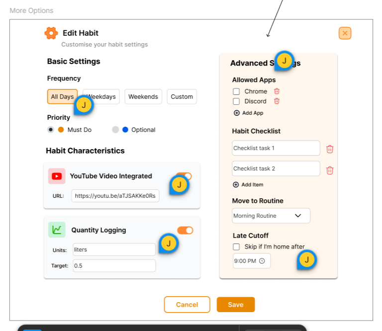
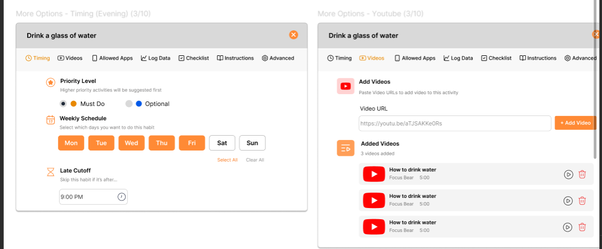

Prototype link: https://www.figma.com/proto/X3gZkyb10X9W8y72XbMSBo/Edit-Habit-Review--Focus-Bear-?node-id=196-603&t=EM3tByNbgkoWBFsO-1
Figma Link: https://www.figma.com/design/X3gZkyb10X9W8y72XbMSBo/Edit-Habit-Review--Focus-Bear-?node-id=293-352&t=EM3tByNbgkoWBFsO-1

Feedback from supervisors:
- Advanced part should be placed after Instructions 
- convert language to be more playful
- Look at “Random” Choice in Micro Breaks
- “Office friendly” toggle moved to Timing 
- Priority level only applicable for Evening routine
- Habits tab changed name to “Checklist” 
# Reflection
## What usability issues can a clickable prototype reveal that a static wireframe cannot?

Clickable prototypes help uncover real interaction problems that static wireframes can’t show. In my task of redesign the Edit Habit, it is important that I added transition between overlays in the More Options tab. Before I cramped all options in one screen, making it lengthy, and if users add more URLs, they have to scroll down to see everything. This is not a great userflow as especially for ADHD folks as the need to scroll down to explore more options increases their anxiety and cognitive load. Regarding such interaction problem, I decided to go with the option of separating each setting in 1 tab, therefore, the configuration options will fit in the screen and elminate the scrolling action.
Previous design: 
Final design: 

## How can prototyping help designers communicate ideas more clearly to developers?

Prototypes bridge the gap between design and development. Instead of trying to explain how a screen should behave, designers can show it by adding interactions and movement to their design. This makes it easier for developers to understand the intended experience and build it accurately without guesswork. My clickable prototype help developers understand easily how the overlays pop up, how to transition between different tabs, whether the animation looks smooth or disturbing.  

## What are common mistakes designers make when creating prototypes?

A few common mistakes include:

- Overcomplicating the prototype with too much visual polish before testing usability. As shown in the previous design, I focused too much on using appealing colors and icons, but forget the cognitive load of users. Each section lacked short description, which help explains why we provide such feature (e.g, the log data tab helps user track their progress for habit such as working out)
- Forgetting interaction details, like button states or transitions that affect the user flow. The transition between overlays was not smooth before, I had to try different ways to make it move smoother and not confusing to the users.
- Not testing early or often, waiting until the prototype is nearly finished.
- Ignoring context, such as different screen sizes or accessibility needs. My supervisor once mentioned that I should think of the responsiveness of the design as the app has mobile and tablet versions also. My previous design was too long in height to put on a mobile screen. 
