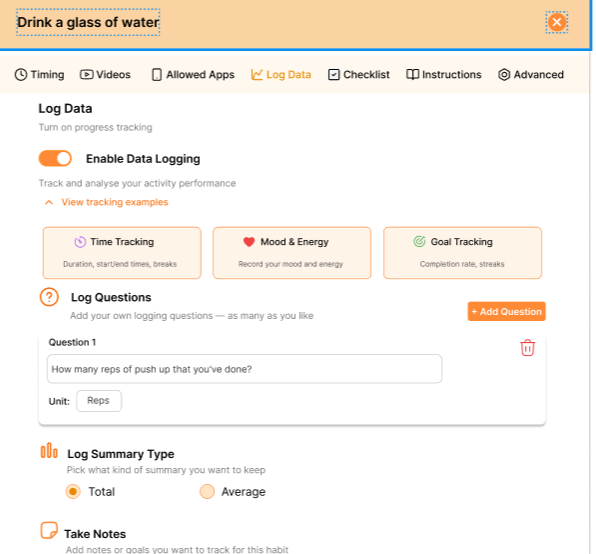
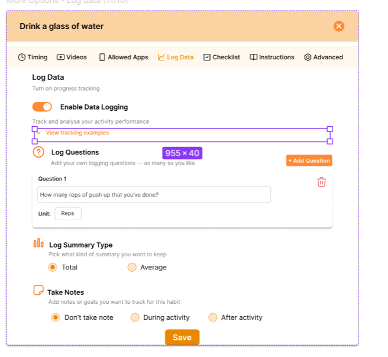

# 📝 Reflection
## How can UX designers balance design vision vs. user feedback when making iterations?
Balancing design vision and user feedback is all about listening without losing focus. I think it’s important to stay open to feedback but also understand the design goals and what problem we’re actually solving. At Focus Bear, I sometimes got different opinions from the team or users, so I’d look for patterns. If multiple people struggled with the same thing, that’s a clear sign it needs changing.

## If conflicting feedback arises, how would you decide what to change?
When feedback conflicted, I’d go back to the user goals and the app’s purpose. Not every suggestion fits the bigger picture, so I’d prioritise what makes the experience clearer and easier for users.
For example, in the Edit Habit screen, some users said that they want an option to revert their changes so I added a Reset button. However, my supervisor said the more than 80% user have no problem with that so we better remove the Reset button to keep the UI clean. 
## What are the risks of iterating too much without clear direction?
Iterating too much without a clear direction can waste time and even make the product worse. It’s easy to keep tweaking forever, but without clear goals or data, you lose consistency and confuse users. So for me, it’s about testing, learning, and improving, but with intention.

# 🛠️ Task
# 📄 Save your files in Markdown format:

Figma link to the final revised prototype: https://www.figma.com/design/X3gZkyb10X9W8y72XbMSBo/Edit-Habit-Review--Focus-Bear-?node-id=196-603&t=njzMXTDhSUNnJghh-1

## Usability test findings & iteration notes:
- The language used for some copies are too formal, which not suit the spirit of Focus Bear. The language for FOcus Bear's users should be playful, friendly, and easy to understand.
- Reset button making the UI looks a bit cluttering.
- The data logging examples are taking a lot of space, which hinders users to focus on important settings. So I made it collapsible with the accordion. 
