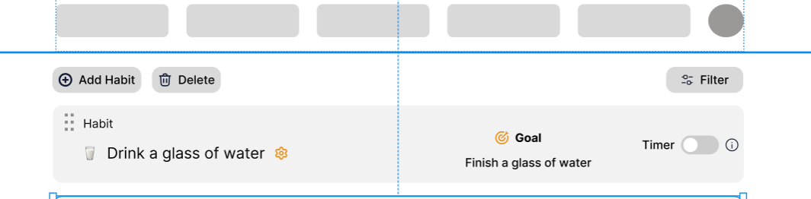
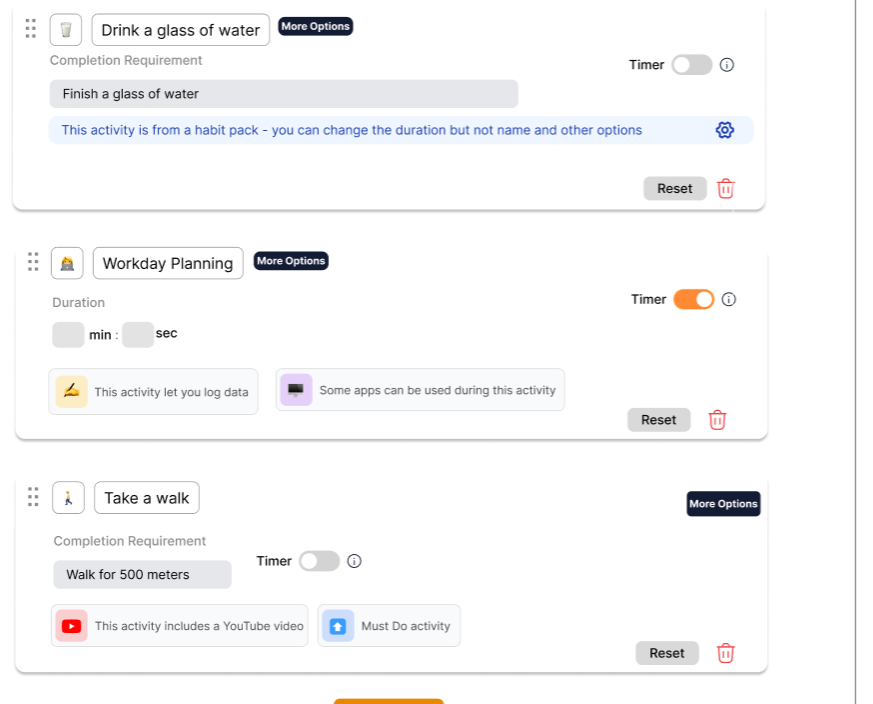
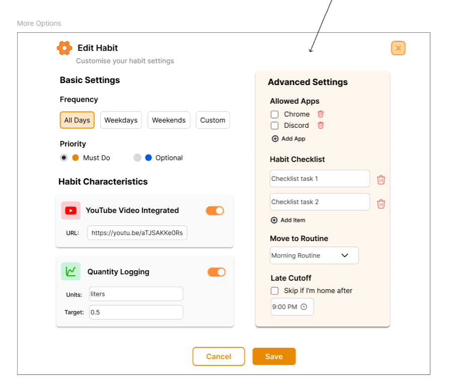
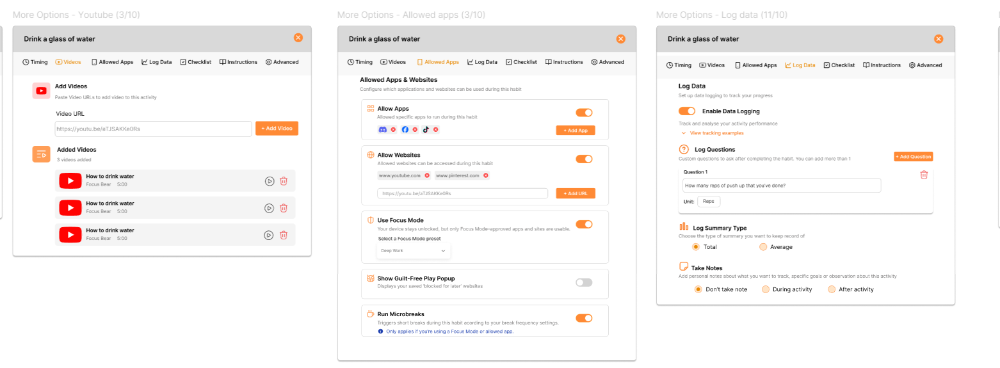
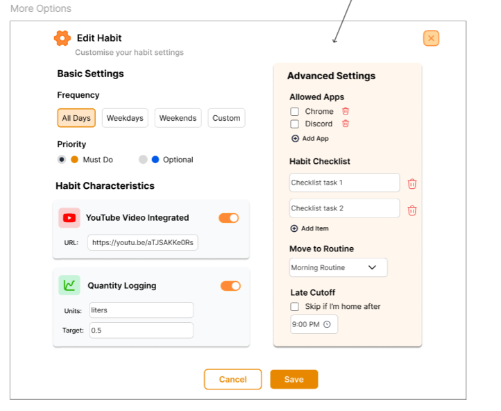
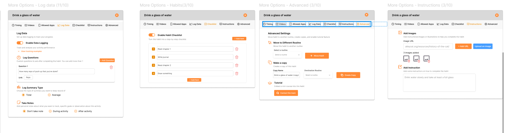

Figma link of design after improvement: https://www.figma.com/design/X3gZkyb10X9W8y72XbMSBo/Edit-Habit-Review--Focus-Bear-?node-id=196-603&t=njzMXTDhSUNnJghh-1
Figma link of design before critics: https://www.figma.com/design/X3gZkyb10X9W8y72XbMSBo/Edit-Habit-Review--Focus-Bear-?node-id=271-1276&t=YbOlbRNkaIaSHe7d-1

Comments from critics (21/9):
- The colors and design look pleasant
- Advanced settings could be made tabs
- Cog icons are not too obvious 
- not sure that icons are editable
- Need tooltips explaining each advanced settings

Comments from critivcs (3/10):
- Advanced part should be placed after Instructions 
- convert language to be more playful
- Look at “Random” Choice in Micro Breaks
- “Office friendly” toggle moved to Timing 
- Priority level only applicable for Evening routine
- Habits tab changed name to “Checklist” 
# How I address the feedback
- Cog icons are not too obvious 
- not sure that icons are editable
for these feedback, I changed the cog icon to the More Options button, making it clearer for users to locate the advanced edit options.
To make it more obvious that users could edit the habit icon within the Edit Habit screen, I added the border around it, which is similar to editable habit name and completion requirement:
Before: 
After: 
- Advanced settings could be made tabs
 Need tooltips explaining each advanced settings
 I addressed these feedback by separating the More Options settings in different tabs and added copy under important headings to give users a quick overview of what's the purpose this configuration
Before: 
 After: 
# 📝 Reflection
## How can a high-fidelity prototype help developers build the final product accurately?
A high-fidelity prototype acts like a clear roadmap for developers. It shows exactly how each screen should look, how elements behave, and how users move through the app. For Focus Bear, this means developers can see details like how the Habit could be edited, and how users navigate through each More Option tab to set up the Timing, or make their habit a checklist. 
The clearer the prototype, the fewer assumptions devs have to make. This help saving time and keeping the final product consistent with the UX vision.
## What are the risks of focusing too much on visuals before usability is validated?
If we focus on making things look good before checking how they work, we risk building something confusing or frustrating. For example, in my previous design, although the colors and icons look pleasant, there were too many elements on 1 screen, which could be overwhelming to users especially neurospicy folks. It is not very responsive either as if users use a smaller screen, the tabs can't be fit on the mobile screen. 

After receiving the feedback from my supervisors, I broke things down into separate tabs, making it easier to focus on 1 feature at a time. I also added copies for every headings, explaining why we provide these feature to users and how they can use them to customise their habits.

## How can small details like button states, hover effects, and transitions improve the user experience?
Small details make a big difference in how smooth and intuitive the app feels. Button states give users feedback — like a subtle color change or bounce when you tap “Run Microbreak” — showing the app is responding. Transitions guide attention and reduce cognitive load by making navigation feel natural and predictable. In Focus Bear, these touches help keep users calm and in flow, rather than distracted by sudden changes or static screens. When changing between different overlays, I made the transition quick but subtle, giving users instant respond after their click and making sure it doesn't raise their anxiety by behaving unexpectedly.